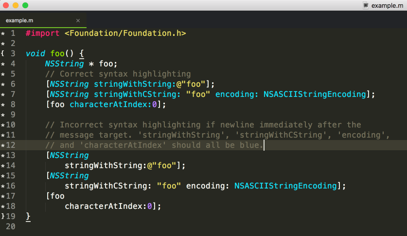

# Text editor - how to choose it?
based on [Choosing A Text Editor](https://medium.com/@theoldercoder/choosing-a-text-editor-3e56f71bd636) by Joe Belli

### What is a text editor?

> "A text editor is a piece of software that you download and install on your computer, or you access online through your web browser, that allows you to write and manage text, especially the text that you write to build a web site." Joe Belli

### The best features for a text editor:
+ code copletion - display possible suggestions based on what was typed
+ syntax highlighting - helps distinguish what is written by colorizing text
+ themes - allow to change the color of the background of your text editor, the series of colors in your text
+ wide selection of extentions - help to change trxt editor to meet user's needs

Examples of text editors: 
+ NotePad++
+ BB Edit
+ Visual Studio Code
+ Atom
+ Brackets
+ Sublime Text

### Text editors vs IDE (Integrated Development Environment)

Text editor| IDE
------------ | -------------
edits files  | text editor 
manages files | file manager
manages lists | a compiler and debugger

Check out as well - Linux Tutorial: 
- [The Command Line!](https://ryanstutorials.net/linuxtutorial/commandline.php)
- [Basic Navigation!](https://ryanstutorials.net/linuxtutorial/navigation.php)
- [More About Files!](https://ryanstutorials.net/linuxtutorial/aboutfiles.php)
