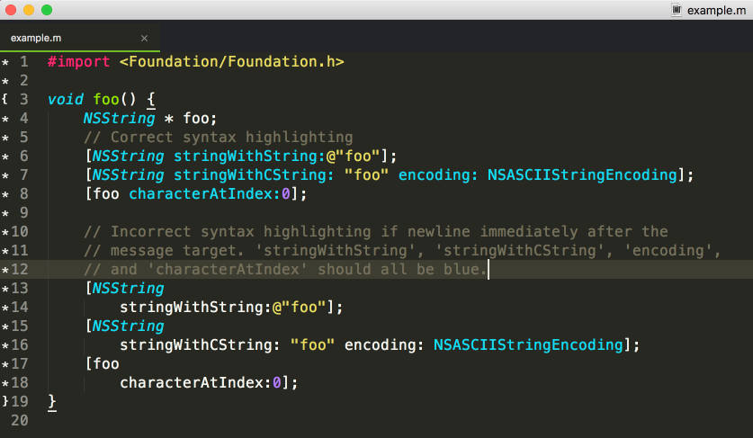

# My Learning Journal - Growth Mindset and Markdown

## What is a Mindset?
Mindset is they way people think abount themselves. A kind of self-theory that people hold about themselves. 

## Type of Mindsets

Fixed Minset | Growth Mindset
------------ | -------------
People believe that that their basic qualities like talent are fixed. People are "labeled": talented, smart intelligent. It is believing that talent along can create a success, without effort. | People believe that their most basic abilities can be developed through dedication and hard work—brains and talent are just the starting point

### Three things to remember about the Growth Mindset:
* No one is a master at the beginning
* Learning a new thing, strategies is hard at the beginning for every one. 
* I don't know **YET!**

More infrmation can be found [www.mindsetonline.com](https://mindsetonline.com/whatisit/whypeoplediffer/index.html)


## Markdown Langauge

Markdown is a lightweight markup language with plain text formatting syntax.

### What is is used for?

Markdown is often used to format readme files, for writing messages in online discussion forums, and to create rich text using a plain text editor

### The hey goal for the language:

Its key design goal is readability – that the language be readable as-is.

## Examples

Code example | How it looks like
------------ | -------------
`# This is an <h1> tag`| # This is an `<h1>` tag
`__This text will be bold__`| __This text will be bold__
Numbered list:  `1 Item 1`| 1 Item 1
  

More info can be found: [guides.github.com](https://guides.github.com/features/mastering-markdown/)


# Text editor - how to choose it?
based on [Choosing A Text Editor](https://medium.com/@theoldercoder/choosing-a-text-editor-3e56f71bd636) by Joe Belli

### What is a text editor?

> "A text editor is a piece of software that you download and install on your computer, or you access online through your web browser, that allows you to write and manage text, especially the text that you write to build a web site." Joe Belli

```
### The best features for a text editor:
+ code copletion - display possible suggestions based on what was typed
+ syntax highlighting - helps distinguish what is written by colorizing text
+ themes - allow to change the color of the background of your text editor, the series of colors in your text
+ wide selection of extentions - help to change trxt editor to meet user's needs
```



Examples of text editors: 
+ NotePad++
+ BB Edit
+ Visual Studio Code
+ Atom
+ Brackets
+ Sublime Text

### Text editors vs IDE (Integrated Development Environment)

Text editor| IDE
------------ | -------------
edits files  | text editor 
manages files | file manager
manages lists | a compiler and debugger


Check out as well - Linux Tutorial: 
- [The Command Line!](https://ryanstutorials.net/linuxtutorial/commandline.php)
- [Basic Navigation!](https://ryanstutorials.net/linuxtutorial/navigation.php)
- [More About Files!](https://ryanstutorials.net/linuxtutorial/aboutfiles.php)


# A Git Tutorial

##3 Version Control

Version Control is a system that allows to revisit various versions of a file or set of files by recording changes.

Version Control (VCS) allows: 
+ file or project can be reverted to previous cersion
+ track modifications and modifying individuals
+ to ompare changes

### Local Version Control

Local VCS entails one database on your hard disk that stores changes to files.

### Centralized Version Control
Created because of the need for collaboration within a developer team on a single file or set of files. Single server stores all changes and file versions kind of data backups.

### Distributed Version Control System (DVCS)
Help to avoid the one big disadvatage: the server as a single point of failure. To avoid data lost DVCS allows clients to create mirrored repositories

## GIT
it is a DVCS that stores data in a file system made up of snapshots. Every commit - changed version - 


#### To check the file Staus use:
```
$ git status
```
#### Tracking a file: 
```
git add filename
```

#### Tracking files:
```
$ git add *
```

#### Making a Commit:

After staging one or multiple files, the changes should be commited and recorded what you did within the commit message:
```
$ git commit -m “made change x,y,z”
```
### A bit about me: 

I'm Ewa. I'm an art historian working as a Client Support. Please don't mind my mistakes. I speak Polish. What is your super power?


